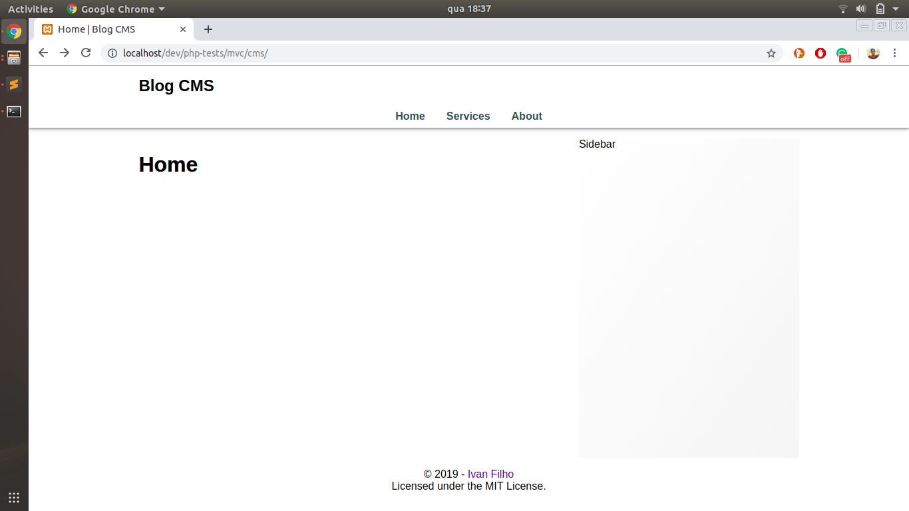

# Content Management Service

The purpose of this project is to create a simple Blog with a Content Management Service (CMS), which allows the blog owner to create, read, update and delete their posts.

### Screenshot

### Author
Ivan Filho
