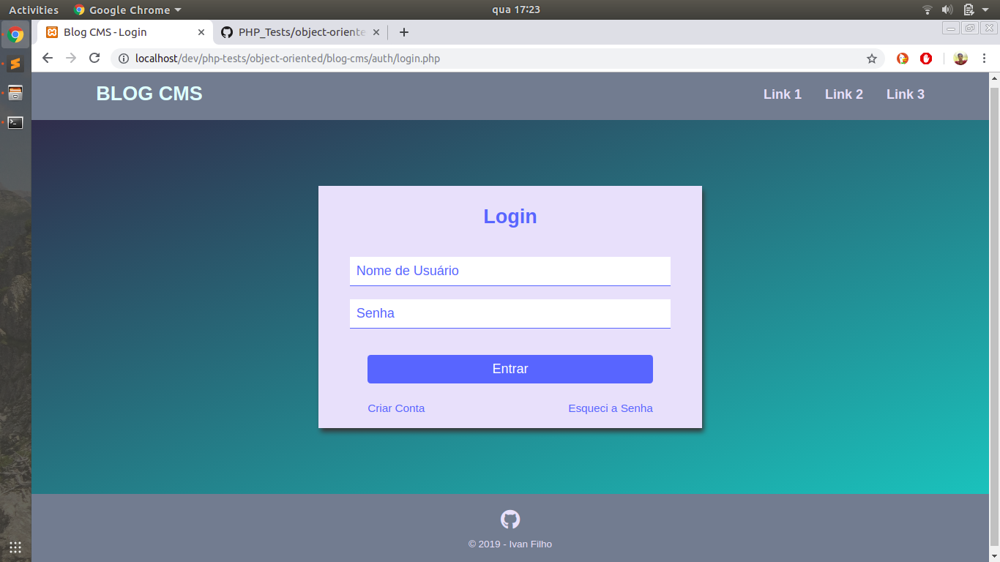

# Blog CMS

The purpose of this is to create a simple Blog with a Content Management Service (CMS), which allows the blog owner to create, read, update and delete posts.

### Screenshot

### Author
Ivan Filho
