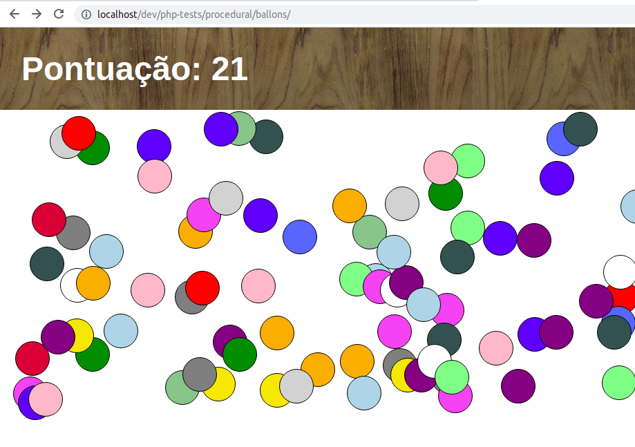

# Balloon Burst

Um simples jogo feito com HTML, CSS e JavaScript que se comunica via AJAX com um servidor PHP. O jogo consiste apenas em estourar balões coloridos.

O jogo é um exercício proposto do curso PZP da B7Web.

## Screenshot

## Author

Ivan Filho